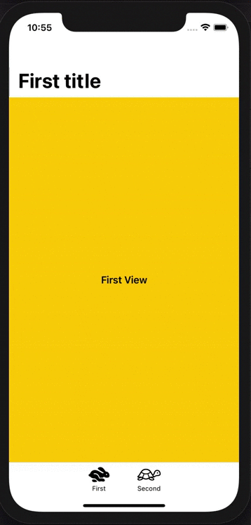

# Custom TabBar in SwiftUI

# Issues that led me to create my own TabBar

TabView in SwiftUI has two important problems to me:
* It does not allow notification badges
* We cannot hide the tabBar when opening a NavigationLink inside a tab

# What this sample app does

This sample code shows how we can create easily our own custom TabBar with ZStack.
* Views are stored as properties in the ContentView to keep the current navigation state when changing tabs.
* The SecondView shows how it should built if we need to hide the TabBar during the navigation.

Feel free to ask me your questions on [Twitter](https://twitter.com/hikeland).